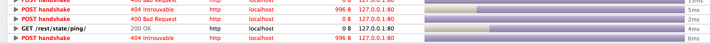
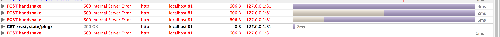

# apache-exo-versions-check
Compare behavior of several versions of apache with a (intentionally) wrong Websocket Configuration

# Why

Until version 2.4.13, if a tentative to update an http connection to a websocket tunnel fail, the connection is reused without flushing the content :
* The websocket error is not forwarded to the client
* The next request failed because the next request is not well formated

The problem seems to be solved in 2.4.13 with this changelog entry :

https://svn.apache.org/repos/asf/httpd/httpd/branches/2.4.x/CHANGES

>   *) mod_proxy_wstunnel: Bypass the handler while the connection is not 
>     upgraded to WebSocket, so that other modules can possibly take over 
>     the leading HTTP requests.  [Yann Ylavic] 


# How

This compose file allow to start several version of apache to test their behavior.

```
# docker-compose up
```

It will build several version of apache in front of and exoplaform instance.

| Port | Apache Version         |
|------|------------------------|
| 80   | 2.4.7 (Ubuntu 14.04)   |
| 81   | 2.4.18 (Ubuntu (16.04) |
| 82   | 2.4.9 (From sources)   |
| 83   | 2.4.10 (From sources)  |
| 84   | 2.4.12 (From sources)  |
| 85   | 2.4.16 (From sources)  |

# Checking

If you connect to the deploy eXo Platform instance (default password root / gtn ) and look at the network inspector, before the version apache version 2.4.13, the websocket connection failed with a return code 400 and 
there the eXo Platform UI can be broken and display a blank page (eXo Platform version 4.4.0 and later) or portlet error messages (eXo Platform prior version 4.4.0). 



After apache version 2.4.13, the wrong websocket connections are correctly handled by apache and return an error code 500 to the client. There is no more portlet crashes.



# Cleanup

To remove volumes and containers :

```
# docker-compose down
```

